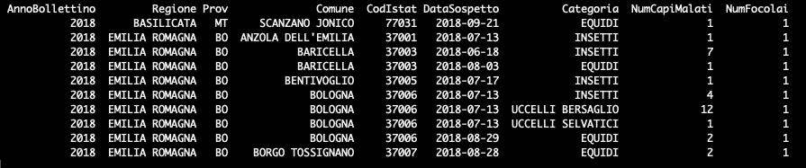
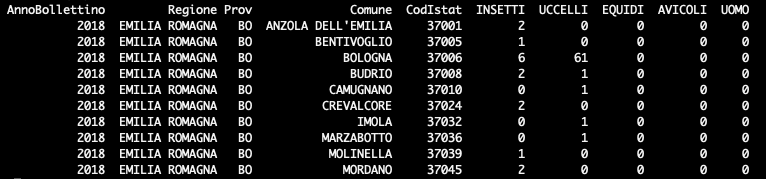

# BollettinoWN
Questo repository contiene gli script per l'elaborazione dei dati del Bollettino Annuale West Nile e USUTU e il materiale per la composizione delle storymaps.

## Dati di input
I file excel di input vengono utilizzati per la generazione dei dati spaziali aggregati. Lo script si aspetta due file:
  * wn.xlsx - *cliccare <a href="https://github.com/IZSAM-StatGIS/BollettinoWN/blob/main/template_xlsx/wn.xlsx">qui</a> per scaricare il template*
  * usutu.xlsx - *cliccare <a href="https://github.com/IZSAM-StatGIS/BollettinoWN/blob/main/template_xlsx/usutu.xlsx">qui</a> per scaricare il template*

Di seguito viene riportata la struttura (con poche righe di esempio del contenuto) che i sopracitati file excel devono rispettare per essere correttamente interpretati ed utilizzati dallo script di preparazione dei dati.

### Struttura di *wn.xlsx*

I valori validi per il campo **Categoria** sono:
  * EQUIDI
  * AVICOLI
  * UCCELLI BERSAGLIO
  * UCCELLI SELVATICI
  * INSETTI
  
### Struttura di *usutu.xlsx*

