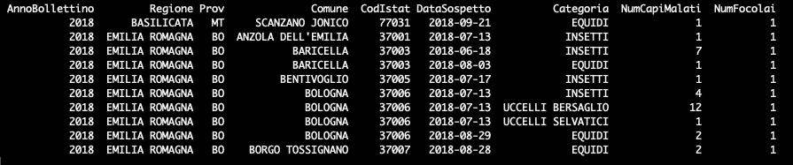
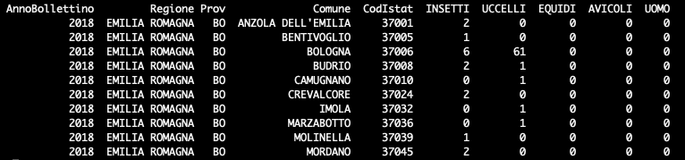

# BollettinoWN
Questo repository contiene gli script per l'elaborazione dei dati del Bollettino Annuale West Nile e USUTU e il materiale per la composizione delle storymaps.

## Dati di input
I file excel di input vengono utilizzati per la generazione dei dati spaziali aggregati. Lo script si aspetta due file:
  * wn.xlsx - *cliccare <a href="risorse/template_xlsx/wn.xlsx">qui</a> per scaricare il template*
  * usutu.xlsx - *cliccare <a href="risorse/template_xlsx/usutu.xlsx">qui</a> per scaricare il template*

Di seguito viene riportata la struttura (con poche righe di esempio del contenuto) che i sopracitati file excel devono rispettare per essere correttamente interpretati ed utilizzati dallo script di preparazione dei dati.

### Struttura di *wn.xlsx*


I valori validi per il campo **Categoria** sono:
  * EQUIDI
  * AVICOLI
  * UCCELLI BERSAGLIO
  * UCCELLI SELVATICI
  * INSETTI
  
### Struttura di *usutu.xlsx*


## Credenziali ArcGIS
Per evitare di salvare username e password in chiaro, le credenziali vengono lette da variabili d'ambiente.

1. Crea un file `.env` nella root del progetto (non verrà versionato).
2. Inserisci le variabili:

```env
ARC_GIS_USERNAME=your_username
ARC_GIS_PASSWORD=your_password
```

In alternativa puoi definire le stesse variabili direttamente nell'ambiente del sistema.

## Script Python
Descrizione sintetica degli script presenti:

- `helpers.py`: contiene funzioni di supporto, tra cui `genera_centroidi` per scaricare i centroidi dei comuni da ArcGIS Online, aggiungere San Marino e salvare lo shapefile in `input/{anno}`.
- `00_verifica_codici_istat.py`: verifica che i codici ISTAT presenti nei file excel di input (`wn.xlsx`, `usutu.xlsx`) siano presenti nello shapefile dei centroidi BDN.
- `01_genera_dataset.py`: genera i dataset spaziali (GeoJSON) per WN e USUTU aggregando i dati Excel e unendoli ai centroidi dei comuni.
- `02_optional_cancella_features_agol.py`: utility per selezionare (e opzionalmente cancellare) feature dai layer ArcGIS Online del bollettino, filtrando per anno.
